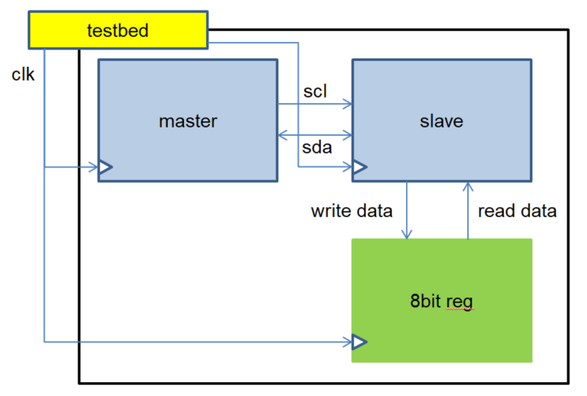
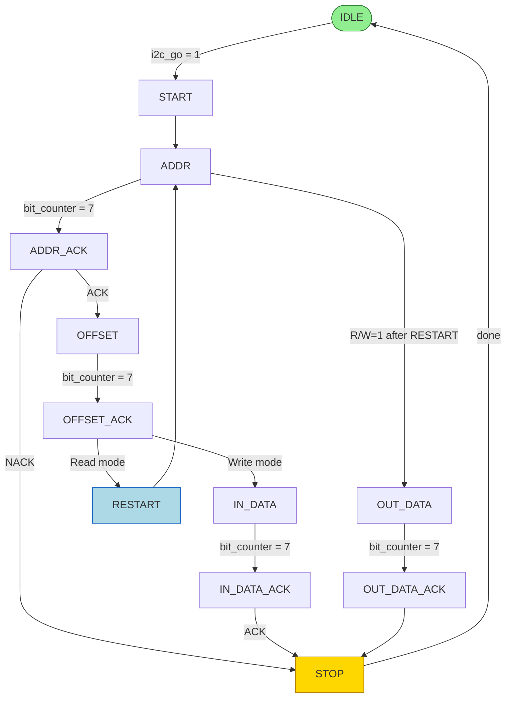
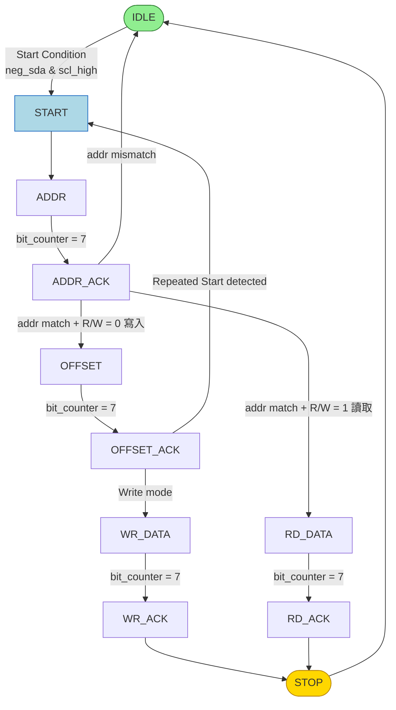

# I²C Protocol — Master / Slave Module 模擬專案

<!-- Badges：僅在 HTML / GitHub 顯示，PDF 渲染時略過 -->
::: {.content-visible when-format="html"}


:::

> 本專案為實習期間以 **Verilog HDL** 實作 I²C（Inter-Integrated Circuit）通訊協議的 Master 與 Slave 模組完整模擬。  
> 設計涵蓋 **One-Hot 有限狀態機（FSM）**、雙向 open-drain `SDA` 匯流排驅動、8-bit Register Map 存取，以及透過 Testbed 進行寫入後讀回的端對端驗證。

---

## 目錄

- [專案簡介](#-專案簡介)
- [I²C 協議概述](#-i²c-協議概述)
- [模組架構](#️-模組架構)
- [FSM 設計](#-fsm-設計)
- [One-Hot 狀態機](#-one-hot-狀態機)
- [訊號說明](#-訊號說明)
- [模擬方式與測試平台](#-模擬方式與測試平台)
- [模擬波形](#-模擬波形)
- [專案結構](#-專案結構)
- [開發環境](#️-開發環境)
- [待改進事項](#-待改進事項)

---

## 專案簡介

I²C 是一種廣泛應用於嵌入式系統中，微控制器與外部裝置之間的**兩線同步串列通訊協議**，由飛利浦半導體（現恩智浦）於 1980 年代初期開發。  
其最大的優勢在於只需 **SCL（時鐘）** 與 **SDA（資料）** 兩條線，便可在同一條匯流排上掛載數十個裝置，廣泛用於感測器、EEPROM、顯示器等外部元件的控制介面。

本專案以純 Verilog HDL 模擬此協議，目的是深入理解 I²C 的底層時序與狀態機設計，並透過波形模擬驗證功能正確性。

### 專案特色

- ✅ 以 Verilog 實作 I²C **Master** 與 **Slave** 兩個完整模組
- ✅ 採用 **One-Hot FSM** 提升狀態辨識效率，降低組合邏輯延遲
- ✅ 支援 **Write** 與 **Read** 兩種操作模式，並實作 Repeated Start
- ✅ 包含 **8-bit Register Map** 做為 Slave 端的內部記憶體存取
- ✅ 實作 **三級同步暫存器（Flip-Flop Synchronizer）** 消除 SDA/SCL 毛刺
- ✅ 具備完整的 **Testbed** 進行端對端（Write → Read）功能驗證

---

## I²C 協議概述

I²C 通訊只需要兩條訊號線，所有裝置共用同一組匯流排：

| 訊號名稱 | 方向 | 電氣特性 | 說明 |
|----------|------|----------|------|
| `SCL` | Master → Slave | Open-drain + Pull-up | 時鐘線，由 Master 驅動，控制資料傳輸節拍 |
| `SDA` | 雙向 | Open-drain + Pull-up | 資料線，Master 與 Slave 皆可拉低驅動 |

> **Open-Drain 特性**：`SCL` 與 `SDA` 都是 open-drain 設計，任何裝置都可拉低（wire-AND），但只能透過外部 Pull-up 電阻拉高，因此匯流排不會發生衝突。

### 主要特性

1. **多主多從架構**：多個 Master 及 Slave 可共存於同一條匯流排，Master 之間以仲裁機制決定優先權
2. **地址化通訊**：每個 Slave 具備唯一 7-bit（或 10-bit）位址，Master 透過位址選擇通訊對象
3. **同步通訊**：所有資料傳輸在 `SCL` 時鐘的控制下進行，`SDA` 只能在 `SCL` 低電位期間改變
4. **ACK/NACK 機制**：每個 Byte 傳輸後的第 9 個時鐘週期，接收端須拉低 `SDA` 送出 ACK；若不回應則為 NACK

### I²C 關鍵時序

| 時序條件 | `SCL` 狀態 | `SDA` 變化 | 說明 |
|----------|-----------|-----------|------|
| **Start Condition** | 高電位 | 高 → 低 | 啟動一次傳輸 |
| **Stop Condition** | 高電位 | 低 → 高 | 結束一次傳輸 |
| **Repeated Start** | 高電位 | 高 → 低 | 不釋放匯流排直接進行下一次傳輸 |
| **Data Valid** | 高電位 | 保持穩定 | `SCL` 高時，`SDA` 必須維持不變 |

### I²C 資料流示意


> 上圖展示 I²C 完整的資料傳輸流程：  
> **Start → 7-bit 位址 + R/W bit → ACK → 8-bit Offset → ACK → 8-bit Data → ACK → Stop**

---

## 模組架構

整個專案由以下 **4 個模組**組成，彼此透過 `SCL`、`SDA`（wire-AND）及暫存器存取訊號互連：

```
testbed  ←── 提供 clk、rst_n、i2c_go 等激勵訊號
  │
  ├── I2C_master  ──SCL──►  I2C_slave
  │       │                     │
  │      SDA (open-drain, tri1)  │
  │       └─────────────────────┘
  │
  └── reg_8bit  ◄──o_wr_en / o_reg_addr / o_wr_data──  I2C_slave
                ──────────i_rd_data──────────────────►  I2C_slave
```

### 模組關係架構圖



### 各模組職責

- **🟦 `I2C_master`**   
  負責產生標準 I²C 時序（Start / Repeated Start / Stop），將 7-bit 位址、8-bit Offset、8-bit 資料依序序列化送出，並在每個 Byte 後等待 Slave 回應 ACK。同時包含時鐘分頻邏輯，將系統時鐘降頻為 I²C 所需的 `SCL`。

- **🟩  `I2C_slave`**   
  透過三級同步暫存器（`sda_ff1/2/3`、`scl_ff1/2/3`）偵測 `SDA` 與 `SCL` 的邊緣事件，識別 Start / Stop Condition，比對裝置位址後進入資料傳輸流程，對 Register Map 進行讀寫操作，並在適當時機拉低 `SDA` 送出 ACK。

- **🟨 `reg_8bit`**   
  簡單的 8-bit 暫存器模組，作為 Slave 的內部記憶體。支援 `en_reg` 控制的同步寫入（Positive Edge Triggered），以及非同步讀出。初始值為 `8'b11111111`，驗證讀回資料時可確認寫入是否成功。

- **`testbed`**   
  產生固定週期的系統時鐘（`CYCLE = 10`），執行 Reset 序列後設定 Slave 位址、Register 偏移與寫入資料，依序驗證 **Write → 等待完成 → Read → 等待完成** 的完整 I²C 通訊流程。

---

## FSM 設計

### 三段式 FSM 架構

本專案遵循 Verilog 最佳實踐的 **三段式 FSM（Three-Always Block）** 寫法，將狀態更新、次態邏輯、輸出動作明確分離，提升可讀性與合成品質：

1. **第一段：Sequential Logic — 狀態更新**  
   在時鐘正緣觸發，負責將 `next_state` 更新至 `state`，Reset 時回到 `IDLE`。

   ```verilog
   always @(posedge clk or negedge rst_n) begin
       if (!rst_n)
           state <= IDLE;
       else
           state <= next_state;
   end
   ```

2. **第二段：Combinational Logic — 次態運算**  
   純組合邏輯，根據當前狀態與輸入條件決定下一個狀態。使用 `case(1'b1)` 搭配 One-Hot 解碼訊號，避免 priority encoder。

   ```verilog
   always @(*) begin
       case (1'b1)
           ST_IDLE:    next_state = (i_i2c_go) ? START : IDLE;
           ST_START:   next_state = ADDR;
           ST_ADDR:    next_state = (bit_counter == 4'd7) ? ADDR_ACK : ADDR;
           ST_ADDR_ACK:next_state = (is_ack) ? OFFSET : STOP;
           // ...
       endcase
   end
   ```

3. **第三段：Sequential Logic — 輸出動作**  
   在時鐘正緣觸發，根據當前狀態執行對應的輸入輸出動作，如拉低 `SDA`、更新計數器、鎖存讀回資料等。

   ```verilog
   always @(posedge clk or negedge rst_n) begin
       case (1'b1)
           ST_ADDR: begin
               // MSB first：依序送出 slave_addr[6]、[5]...、[0]
               sda_out <= slave_addr[6 - bit_counter];
           end
           ST_ADDR_ACK: begin
               is_ack <= ~sda_in;  // SDA 被 Slave 拉低 = ACK
           end
           // ...
       endcase
   end
   ```

### 🗺️ Master 狀態流程圖


> Master 共有 **12 個狀態**：`IDLE → START → ADDR → ADDR_ACK → OFFSET → OFFSET_ACK → IN_DATA / OUT_DATA → IN_DATA_ACK / OUT_DATA_ACK → STOP`。  
> 讀取操作時，Master 在送出 Offset 後會發出 **Repeated Start（RESTART）** 再重送位址（R/W=1），以切換 SDA 方向。

以下為 Master FSM 的 Mermaid 狀態轉移圖：



### Slave 狀態流程圖


> Slave 共有 **11 個狀態**，以邊緣偵測方式識別 Start / Stop Condition，自動比對位址後進入對應的資料傳輸或輸出流程。

以下為 Slave FSM 的 Mermaid 狀態轉移圖：



---

## One-Hot 狀態機

本專案採用 **One-Hot（獨熱碼）** 狀態編碼方式，是 FPGA 設計中的常見選擇。

### 原理

每個狀態對應一個獨立的 bit 位置，**同一時間只有一個 bit 為 `1`**，其餘全為 `0`。  
以 Master 的 12 個狀態為例，狀態向量寬度為 12-bit：

$$\text{State}[11:0] \in \{000000000001_2,\ 000000000010_2,\ 000000000100_2,\ \ldots,\ 100000000000_2\}$$

任意時刻恰好滿足：

$$\sum_{i=0}^{N-1} \text{State}[i] = 1$$

### Master 狀態定義

```verilog
localparam IDLE         = 12'b000000000001; // State[0]
localparam ADDR         = 12'b000000000010; // State[1]
localparam OFFSET       = 12'b000000000100; // State[2]
localparam IN_DATA      = 12'b000000001000; // State[3]
localparam OUT_DATA     = 12'b000000010000; // State[4]
localparam ADDR_ACK     = 12'b000000100000; // State[5]
localparam OFFSET_ACK   = 12'b000001000000; // State[6]
localparam IN_DATA_ACK  = 12'b000010000000; // State[7]
localparam OUT_DATA_ACK = 12'b000100000000; // State[8]
localparam STOP         = 12'b001000000000; // State[9]
localparam START        = 12'b010000000000; // State[10]
localparam RESTART      = 12'b100000000000; // State[11]
```

### ⚡ One-Hot 狀態解碼

透過 `assign` 直接解析對應 bit，**完全不需要解碼器邏輯**：

```verilog
assign ST_IDLE         = state[0];
assign ST_ADDR         = state[1];
assign ST_OFFSET       = state[2];
assign ST_IN_DATA      = state[3];
assign ST_OUT_DATA     = state[4];
assign ST_ADDR_ACK     = state[5];
assign ST_OFFSET_ACK   = state[6];
assign ST_IN_DATA_ACK  = state[7];
assign ST_OUT_DATA_ACK = state[8];
assign ST_STOP         = state[9];
assign ST_START        = state[10];
assign ST_RESTART      = state[11];
```

因此在 FSM 的 `case` 判斷中可直接寫成 `case(1'b1)` 搭配 `ST_XXX` 訊號，邏輯直觀且合成後的電路更為扁平。

### ⚖️ One-Hot vs. Binary 編碼比較

| 比較項目 | One-Hot 編碼 | Binary 編碼 | Grey Code 編碼 |
|----------|:-----------:|:-----------:|:-------------:|
| 需要位元數 | $N$ bits | $\lceil \log_2 N \rceil$ bits | $\lceil \log_2 N \rceil$ bits |
| 需要解碼器 | ❌ 不需要 | ✅ 需要 | ✅ 需要 |
| 狀態辨識速度 | 最快 | 需解碼 | 需解碼 |
| 合成後邏輯深度 | 淺（單層） | 較深 | 較深 |
| 適合場景 | **FPGA**、高速 | ASIC、狀態數多 | 跨時鐘域設計 |
| 功耗 | 較高（位元數多） | 低 | 低（只 1-bit 翻轉） |
| Glitch 風險 | 低 | 較高 | 最低 |

> **本專案選用 One-Hot 的理由**：在 FPGA LUT 架構中，One-Hot 能使每個狀態的判斷僅需讀取單一 flip-flop 輸出，減少組合邏輯的扇入（fan-in），有效縮短關鍵路徑延遲，提升電路可運作的最高頻率（$F_{max}$）。

---

## 訊號說明

### 🟦 I2C_master 埠口

`I2C_master` 作為匯流排的主控端，對外暴露以下介面：

| 訊號 | 方向 | 寬度 | 說明 |
|------|:----:|:----:|------|
| `o_reg_data` | output | 8-bit | 從 Slave Register 讀回的資料 |
| `o_rd_done` | output | 1-bit | 讀取操作完成旗標（pulse） |
| `o_wr_done` | output | 1-bit | 寫入操作完成旗標（pulse） |
| `o_i2c_done` | output | 1-bit | I²C 整體傳輸完成旗標，Testbed 透過此訊號判斷是否可以進行下一次操作 |
| `scl` | output | 1-bit | I²C 時鐘線，由內部分頻邏輯產生 |
| `sda` | inout | 1-bit | I²C 資料線（open-drain，高阻抗釋放） |
| `i_i2c_go` | input | 1-bit | 高電位觸發一次 I²C 傳輸，`IDLE → START` |
| `i_rw` | input | 1-bit | `0` = 寫入模式，`1` = 讀取模式 |
| `i_reg_addr` | input | 8-bit | 目標 Slave 暫存器的偏移位址（Offset） |
| `i_wr_data` | input | 8-bit | 欲寫入 Slave 的資料 |
| `i_cycle` | input | 8-bit | 時鐘分頻參數，控制 SCL 頻率 |
| `i_i2c_slave_addr` | input | 7-bit | 目標 Slave 裝置位址（7-bit） |

### 🟩 I2C_slave 埠口

`I2C_slave` 作為被動接收端，透過以下介面與 Register Map 互動：

| 訊號 | 方向 | 寬度 | 說明 |
|------|:----:|:----:|------|
| `o_wr_en` | output | 1-bit | 高電位時致能 Register 寫入 |
| `o_reg_addr` | output | 8-bit | 當前存取的 Register 位址 |
| `o_wr_data` | output | 8-bit | 欲寫入 Register 的資料內容 |
| `o_rd_done` | output | 1-bit | 讀取完成旗標 |
| `scl` | input | 1-bit | 接收來自 Master 的時鐘訊號 |
| `sda` | inout | 1-bit | I²C 資料線（open-drain） |
| `i_slave_addr` | input | 7-bit | 本裝置的 Slave 位址，用於比對 Master 送出的位址 |
| `i_rd_data` | input | 8-bit | 從 `reg_8bit` 讀入、準備回傳 Master 的資料 |

### 🟨 reg_8bit 埠口

| 訊號 | 方向 | 寬度 | 說明 |
|------|:----:|:----:|------|
| `d_out` | output | 8-bit | 暫存器目前的資料輸出（非同步讀出） |
| `d_in` | input | 8-bit | 欲寫入的資料 |
| `en_reg` | input | 1-bit | 寫入致能，高電位且時鐘正緣觸發時更新暫存器 |
| `clk` | input | 1-bit | 系統時鐘 |
| `rst_n` | input | 1-bit | 主動低電位 Reset，初始值為 `8'hFF` |

---

## 模擬方式與測試平台

### testbed 測試流程

本次模擬驗證的測試情境為：**先寫入 `0xC3` 至位址 `0x55`，再從相同位址讀回資料，確認一致**。

```
步驟 1 ── 系統 Reset（rst_n 拉低 2 cycle 後拉高）
步驟 2 ── 設定 Slave 位址：0b010_0110  → 0x26
步驟 3 ── 設定 Register 偏移：0b0101_0101 → 0x55
步驟 4 ── 設定寫入資料：0b1100_0011 → 0xC3
步驟 5 ── 拉高 i_i2c_go，i_rw = 0 → 啟動 Write 操作
步驟 6 ── 等待 o_i2c_done 拉高 → Write 完成
步驟 7 ── 拉低 i_i2c_go，等待 2 cycle
步驟 8 ── 拉高 i_i2c_go，i_rw = 1 → 啟動 Read 操作（含 Repeated Start）
步驟 9 ── 等待 o_i2c_done 拉高 → Read 完成，o_reg_data 應為 0xC3
步驟 10 ── $stop
```

### Testbed 關鍵程式碼

```verilog
initial begin
    rst_n = 1'b1;
    repeat(2) @(posedge clk);
    rst_n = 1'b0;           // Assert reset（主動低電位）
    repeat(2) @(posedge clk);
    rst_n = 1'b1;           // Release reset

    @(posedge clk);
    // ── Write Phase ───────────────────────────────────
    i_i2c_go         = 1'b1;
    i_rw              = 1'b0;           // Write mode
    i_i2c_slave_addr  = 7'b010_0110;   // Slave addr = 0x26
    i_slave_addr      = 7'b010_0110;   // Slave 端需設定相同位址才會 ACK
    i_reg_addr        = 8'b0101_0101;  // Register offset = 0x55
    i_wr_data         = 8'b1100_0011;  // Data to write = 0xC3

    wait(o_i2c_done == 1'b1);          // 等待 Write 完成
    i_i2c_go = 1'b0;
    repeat(2) @(posedge clk);

    // ── Read Phase ────────────────────────────────────
    i_i2c_go = 1'b1;
    i_rw     = 1'b1;                   // Read mode（Master 發出 Repeated Start）
    wait(o_i2c_done == 1'b1);          // 等待 Read 完成，o_reg_data 應為 0xC3
    $stop;
end
```

### SDA Open-Drain 驅動實作

I²C 的 `SDA` 為 open-drain 匯流排，本專案以下列方式在 Verilog 中模擬：

```verilog
// Master 與 Slave 皆使用相同方式驅動 SDA：
// sda_out = 1 → 釋放匯流排（高阻抗 1'bz），由 Pull-up 拉高
// sda_out = 0 → 主動拉低匯流排
assign sda = sda_out ? 1'bz : 1'b0;
assign sda_in = sda;  // 讀回匯流排實際電位
```

Testbed 將 `sda` 宣告為 `tri1`，模擬外部 Pull-up 電阻：

```verilog
tri1 sda;  // 無人驅動時預設為邏輯 1（模擬 Pull-up）
```

### Slave 訊號同步設計

由於 Slave 使用系統時鐘（`clk`）取樣非同步的 `SDA` 與 `SCL`，須透過 **三級同步暫存器（3-FF Synchronizer）** 消除亞穩態（Metastability）並偵測邊緣：

```verilog
always @(posedge clk or negedge rst_n) begin
    if (!rst_n) begin
        sda_ff1 <= 0; sda_ff2 <= 0; sda_ff3 <= 0;
        scl_ff1 <= 0; scl_ff2 <= 0; scl_ff3 <= 0;
    end else begin
        sda_ff1 <= sda_in;  sda_ff2 <= sda_ff1;  sda_ff3 <= sda_ff2;
        scl_ff1 <= scl;     scl_ff2 <= scl_ff1;  scl_ff3 <= scl_ff2;
    end
end

// 邊緣偵測
assign sync_pos_sda =  sda_ff2 & ~sda_ff3;  // SDA 上升緣
assign sync_neg_sda = ~sda_ff2 &  sda_ff3;  // SDA 下降緣（Start Condition）
assign sync_pos_scl =  scl_ff2 & ~scl_ff3;  // SCL 上升緣（資料取樣點）
assign sync_neg_scl = ~scl_ff2 &  scl_ff3;  // SCL 下降緣（SDA 可改變）
```

- [x] Master 驅動 `sda_out` 輸出位元資料（MSB First）
- [x] Slave 透過 `sda_ff1/ff2/ff3` 三級同步消除毛刺後再取樣
- [x] Slave 偵測 SCL 上升緣作為資料取樣點
- [x] Testbed 宣告 `tri1 sda`，確保匯流排預設為高電位

---

## 模擬波形

模擬完成後，可於波形工具（GTKWave / ModelSim）觀察以下關鍵訊號群組：


### 波形判讀重點

| 時序事件 | 波形特徵 | 驗證重點 |
|----------|----------|----------|
| **Start Condition** | `SCL` High 時，`SDA` 出現下降緣 | FSM 由 `IDLE → START → ADDR` |
| **位址幀** | 連續 7 個 `SCL` 週期，`SDA` 依序輸出 `010_0110` | MSB First，`0x26` |
| **R/W bit** | 第 8 個 `SCL` 週期，`SDA = 0`（Write）或 `SDA = 1`（Read） | 寫入時為 0 |
| **ACK** | 第 9 個 `SCL` 週期，Slave 拉低 `SDA` | `is_ack` 訊號應為 1 |
| **Offset 幀** | 連續 8 個 `SCL` 週期輸出 `0101_0101`（`0x55`） | Register 偏移位址 |
| **Data 幀** | 連續 8 個 `SCL` 週期輸出 `1100_0011`（`0xC3`） | 寫入資料 |
| **Stop Condition** | `SCL` High 時，`SDA` 出現上升緣 | FSM 進入 `STOP → IDLE` |
| **Repeated Start** | Stop 後不久，`SCL` High，`SDA` 再次下降 | Read Phase 開始 |
| **讀回資料** | Slave 驅動 `SDA` 輸出 `0xC3` | 應與寫入值一致 |

> ✅ **預期結果**：模擬結束時 `o_reg_data = 8'hC3`，確認 Write → Read 流程正確無誤。

---

## 專案結構

```
I2C_simulation/
├── I2C_master.v        # Master 模組 — 12 狀態 FSM + 時鐘分頻 + SDA 序列化輸出
├── I2C_slave.v         # Slave 模組 — 11 狀態 FSM + 3-FF 訊號同步 + ACK 產生
├── reg_8bit.v          # 8-bit Register Map — 同步寫入 / 非同步讀出
├── testbed.v           # 模擬測試平台 — Write → Read 端對端驗證
├── README_I2C.md       # 原始設計說明文件
├── content.md          # 本文件（完整專案介紹）
└── image/
    ├── i2c data flow.png        # I²C 通訊資料流示意圖
    ├── master state.drawio.png  # Master FSM 完整狀態轉移圖
    ├── slave state.drawio.png   # Slave FSM 完整狀態轉移圖
    ├── module.png               # 模組連接架構圖
    └── simulate waveform.png   # 功能驗證波形截圖
```

---

## 開發環境

| 工具 / 技術 | 版本 / 說明 |
|------------|------------|
| 硬體描述語言 | Verilog HDL (IEEE 1364-2001) |
| 模擬工具 | ModelSim SE / Icarus Verilog (iverilog) |
| 波形檢視 | GTKWave / ModelSim Wave Editor |
| 繪圖工具 | [draw.io](https://app.diagrams.net/)（FSM 狀態圖） |
| 版本控制 | Git / GitHub |

### 編譯與模擬指令（以 iverilog 為例）

> 以下指令適用於安裝有 [Icarus Verilog](https://github.com/steveicarus/iverilog) 的環境。

```bash
# 1. 編譯所有模組（testbed 需排在最前面）
iverilog -o i2c_sim testbed.v I2C_master.v I2C_slave.v reg_8bit.v

# 2. 執行模擬
vvp i2c_sim

# 3. 若 testbed 中已加入 dump 指令，開啟波形檔
gtkwave dump.vcd
```

若要啟用波形輸出，需在 `testbed.v` 的 `initial` 區塊中加入：

```verilog
initial begin
    $dumpfile("dump.vcd");   // 指定輸出波形檔名
    $dumpvars(0, testbed);   // dump testbed 下所有訊號
end
```

---

## 待改進事項

以下為後續可延伸的功能方向，歡迎 Fork 後繼續開發：

- [ ] 支援**多 Slave 裝置**的地址仲裁（Bus Arbitration）
- [ ] 加入 **Clock Stretching** 機制，允許 Slave 暫停 Master 的傳輸
- [ ] 支援 **10-bit 位址**模式，擴充可定址的裝置數量
- [ ] 擴充為**多主（Multi-Master）**架構，加入仲裁邏輯
- [ ] 加入更完整的 **Assertion-Based Verification（ABV）**，以 SVA 驗證協議合規性
- [ ] 封裝成 **UVM Testbench**，加入 Scoreboard 自動化比對讀回值
- [ ] 移植至 **FPGA 開發板**進行實際硬體驗證

---

## 參考資料

- [I²C-bus specification and user manual — NXP Semiconductors (UM10204)](https://www.nxp.com/docs/en/user-guide/UM10204.pdf)
- [Wikipedia: I²C Protocol](https://en.wikipedia.org/wiki/I%C2%B2C)
- *Digital Design and Computer Architecture* — David Harris & Sarah Harris
- [FPGA4Fun — I2C](https://www.fpga4fun.com/I2C.html)

---

> *本專案為實習期間個人獨立設計與實作，旨在深入學習數位電路 FSM 設計方法與通訊協議的底層實現。*  
